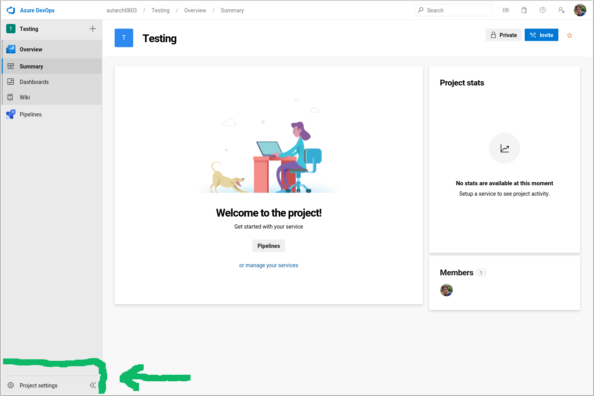
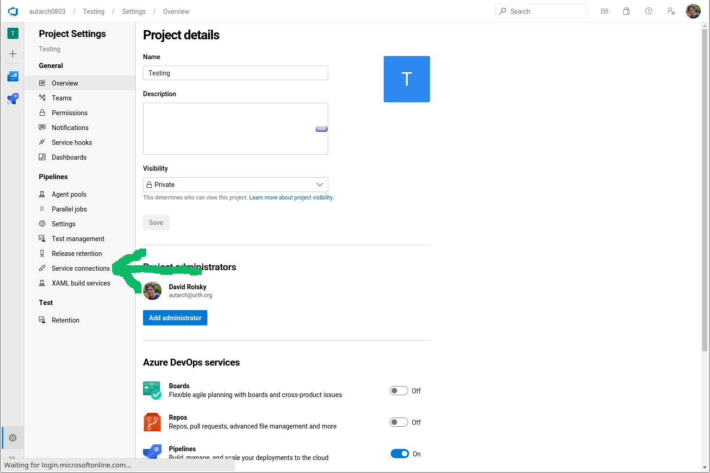
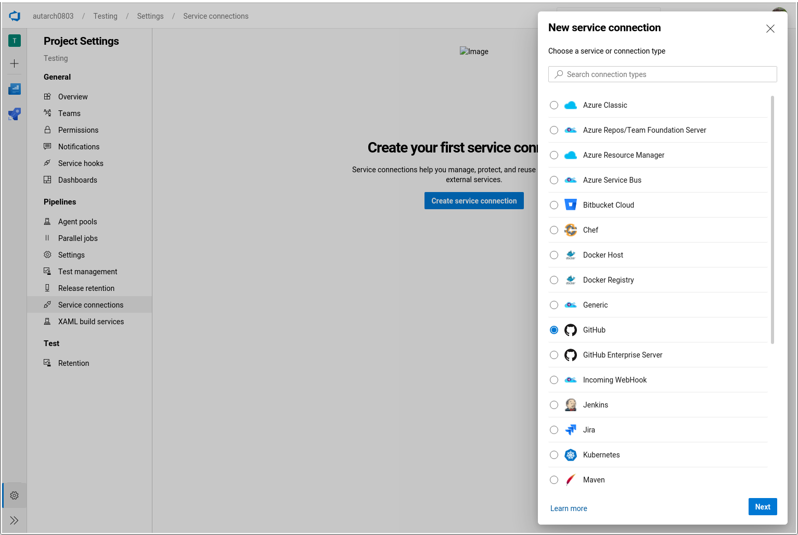
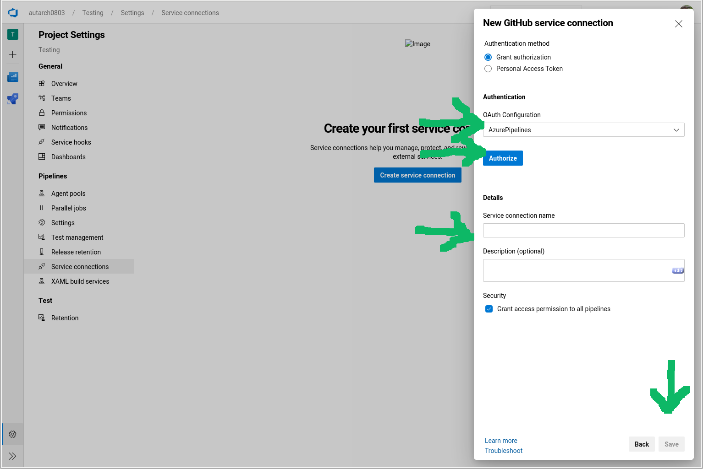

# Perl Helper Tools for Azure Pipelines

This repo contains a set of tools and [Azure
Pipelines](https://azure.microsoft.com/en-us/services/devops/pipelines/)
templates designed to make it easy to test Perl projects with multiple
versions of Perl across Linux, macOS, and Windows.

## Stability Level

I try to do all work in branches so that the master branch will always work
with existing projects. However, I may make breaking changes to the way
templates are used, so I encourage you to pin your use to a tag. See below for
details on how to do that.

## Creating a Service Connection

In order to use these templates in your pipelines you must create a "Service
Connection" for your Azure project. Fortunately this is only needed once per
Azure project, and a single project can contain many pipelines, each of which
corresponds to a single code project (GitHub repo, Subversion repo, etc.).

Go to https://dev.azure.com/.

Click on the project that contains (or will contain) the pipelines which will use these templates.

Click on the gear icon in the lower left.



Click on "Service Connections".



Select "New service connection", then "GitHub".



For "Authentication method" select "Grant authorization".



For "OAuth Configuration" select "AzurePipelines".

Click on "Authorize". You may be prompted to log in to GitHub and/or to allow
a third party application to access GitHub on your behalf. You will need to
allow this, obviously.

The connection name can be anything you want. It is simply used to refer to
the connection in your `azure-pipelines.yml` files. I suggest using
`houseabsolute/ci-perl-helpers` if you don't have a naming scheme you want to
use.

Click on "Save".

If you have multiple Azure DevOps projects you will need to do this once per
project. Note that a single project can contain many repos with many
pipelines. You only need separate projects if you want separate ACLs.

## Quick Start

Put this in your `azure-pipelines.yml` file:

```yaml
resources:
  repositories:
    - repository: ci-perl-helpers
      type: github
      name: houseabsolute/ci-perl-helpers
      endpoint: houseabsolute/ci-perl-helpers

stages:
  - template: templates/build.yml@ci-perl-helpers
  - template: templates/linux.yml@ci-perl-helpers
    parameters:
      test_xt: true
      use_default_perls: true
  - template: templates/macos.yml@ci-perl-helpers
    parameters:
      use_default_perls: true
  - template: templates/windows.yml@ci-perl-helpers
    parameters:
      use_default_perls: true
```

The `resources.repositories.endpoint` value must match the name of the Service
Connection you created.

This will test your Perl project in the following scenarios:

- On Windows, using the latest stable version of Perl available via
  [Berrybrew](https://github.com/stevieb9/berrybrew).
- On macOS, using the latest stable version of Perl.
- On Linux with the last stable release of each major Perl version starting
  from 5.8.9 up to the newest stable release (5.30.1 at the time this was
  written).
- On Linux with the latest dev release of Perl.
- On Linux with the current contents of the `blead` branch of the
  [github.com/Perl/perl5 repo](https://github.com/Perl/perl5). If tests fail
  when `prove` is run then your pipeline will still pass, but a failure to
  compile your code will cause the pipeline to fail.

## Pinning a Helpers Version

If you do not specify a `ref` when referring to this repo, your build will
always pull the latest version of this project's templates from this repo's
`master` branch. To pin your project to a specific verson of these templates,
add a `ref` key:

```yaml
resources:
  repositories:
    - repository: ci-perl-helpers
      type: github
      name: houseabsolute/ci-perl-helpers
      ref: refs/tags/v0.1.0
      endpoint: houseabsolute/ci-perl-helpers
```

## Common Parameters

There is one template for the build stage, `build.yml`, and three test stage
templates, `linux.yml`, `macos.yml`, and `windows.yml`.

All of these take the following common parameters:

| Name            | Type    | Default                                     | Description                                                                                                                                                                                                                                                                                                                                                                                                                                             |
| --------------- | ------- | ------------------------------------------- | ------------------------------------------------------------------------------------------------------------------------------------------------------------------------------------------------------------------------------------------------------------------------------------------------------------------------------------------------------------------------------------------------------------------------------------------------------- |
| `cache_key`     | string  | `"cache"`                                   | If you set this to a string it will be used as part of the cache key for the Perl installation used by this stage. Every time you change this key you will invalidate the old cache. In most cases you should not need to change this, but if your build fails in a confusing way you can try setting this to see if that fixes the problem. If it does, just leave the new key in place and the next build will use the new cache.                     |
| `debug`         | boolean | `false`                                     | If you set this to a true value then the helper tools will spew out a lot more debugging information. Please set this to true and do a build before reporting issues with these tools. That way I can look at your failed build and have a better sense of what went wrong.                                                                                                                                                                             |

The `build.yml` and `linux.yml` stages both take an `image_version` parameter:

| Name            | Type    | Default                                     | Description                                                                                                                                                                                                                                                                                                                                                                                                                                             |
| --------------- | ------- | ------------------------------------------- | ------------------------------------------------------------------------------------------------------------------------------------------------------------------------------------------------------------------------------------------------------------------------------------------------------------------------------------------------------------------------------------------------------------------------------------------------------- |
| `image_version` | string  | tag or branch of the `ci-perl-helpers` repo | This is the suffix used as part of the Docker tag for image that the build job runs on. You should not set this manually unless you have a very good reason. By default, this suffix is determined by looking at the version of the `ci-perl-helpers` repo that you referenced. This will be checked out and the appropriate tag or branch name will be chosen based on that checkout. This is only used for the `build.yml` and `linux.yml` templates. |

## Test Stages

The test stages share most of their parameters in common.

### Choosing Perl Versions

There are a number of options for choosing which versions of Perl you want to
test with. When referring to Perl versions there are two different ways to do
so. You can pass a full version like `"5.12.1"` or `"5.28.2"`, or you can pass
just the major and minor version like `"5.12"` or `"5.28"`. If you just pass
major and minor then the helpers will automatically pick the highest patch
release for that minor series of releases.

You can also use the following strings:

- `latest` - the most recent stable Perl release
- `dev` - the most recent dev release
- `blead` - a Perl will be built from the latest code in the perl5 git repository.

The templates accept the following parameters to determine which Perls to test with.

| Name                      | Type             | Default       | Description                                                                                                                                                                                               |
| ------------------------- | ---------------- | ------------- | --------------------------------------------------------------------------------------------------------------------------------------------------------------------------------------------------------- |
| `use_default_perls`       | boolean          | `false`       | If this is true, the stage will use whatever the default Perl versions are for that operating system. See the "Quick Start" section above for a description of each template's defaults.                  |
| `perls`                   | array of strings | `[]`          | You can use this to provide an explicit list of Perl versions to test with.                                                                                                                               |
| `from_perl` and `to_perl` | string           | `""`          | You can set one or both of these to ask for a range of Perl versions. The range is _inclusive_ of both the low and high ends. See below for more details.                                                 |
| `include_threads`         | boolean          | false         | If this is true then both unthreaded and threaded versions of each Perl will be tested. This parameter is not supported by the `windows.yml` template since on Windows Perl is always built with threads. |
| `allow_failure`           | array of strings | `[ "blead" ]` | An array of Perl versions for which test failures are not treated as a failure of the CI job. You can refer to Perl versions in this array using the same options as you do elsewhere.                    |

#### Ranges

When selecting a range of Perls, the last patch release of a minor series will
be selected. If you leave one end of the range unset, then it uses the default
bounds for the range. The default lowest Perl is 5.8.9 and the default highest
Perl is blead.

#### Available Versions

The following versions are available on Linux and macOS:

- 5.8.9
- 5.10.1
- Every stable release thereafter.
- `latest`, the most recent stable release.
- `dev`, the most recent dev release, such as 5.31.7.
- `blead`, the latest commit to the perl5 git repository.

On Windows, the available versions are the same as those supported by
[Berrybrew](https://github.com/stevieb9/berrybrew). When a version is
available in both 64- and 32-bit variants, the 64-bit variant will always be
chosen.

### Other Parameters

All of the test stages allow you to run coverage and extended tests, to
provide custom steps, and to install arbitrary packages.

| Name                                              | Type             | Default | Description                                                                                                                                                                                                                                                                                                                                                                           |
| ------------------------------------------------- | ---------------- | ------- | ------------------------------------------------------------------------------------------------------------------------------------------------------------------------------------------------------------------------------------------------------------------------------------------------------------------------------------------------------------------------------------- |
| `coverage`                                        | string           | `""`    | By default the test stages do not run tests with coverage enabled. You can use this parameter to enable a coverage test. If you set this to a non-empty string then coverage will be tested with the most recent stable release of Perl included in this stage. The value of this string determines the type of coverage report that is generated. See below for the allowed options. |
| `coverage_partitions`                             | number           | 1       | Running tests under `Devel::Cover` can be **much** slower than running them normally. You can partition coverage testing into an arbitrary number of partitions to make this faster.                                                                                                                                                                                                  |
| `coverage_perl`                                   | string           | `""`    | The version of Perl to use when running coverage tests. By default this will be the most recent stable version of Perl included in this stage will be used.                                                                                                                                                                                                                           |
| `publish_coverage_artifact`                       | boolean          | false   | If this is true then the raw output from `Devel::Cover` will be published as a build artifact. This is disabled by default because some test suites generate incredibly enormous numbers of coverage files, which take a very long time to publish.                                                                                                                                   |
| `test_xt`                                         | boolean          | false   | If this is true, then one of the test runs will be done with the `AUTOMATED_TESTING`, `AUTHOR_TESTING`, `EXTENDED_TESTING`, and `RELEASE_TESTING` environment variables will be set. In addition, the `xt` directory will be tested in addition the usual `t` directory. This will be done with the most recent stable release of Perl included in this stage.                        |
| `extra_prereqs`                                   | array            | `[]`    | A list of extra Perl packages to be installed before running tests. This list will be passed to `cpm install`.                                                                                                                                                                                                                                                                        |
| `pre_test_steps` and `post_test_steps`            | array of steps   | `[]`    | You can provide an arbitrary list of steps to be run at the start or end of the job that runs the tests.                                                                                                                                                                                                                                                                              |
| `apt` (Linux), `brew`, (macOS), `choco` (Windows) | array of strings | `[]`    | You can use this to pass a list of packages to be installed by the appropriate package manager (Apt, Brew, or Chocolatey).                                                                                                                                                                                                                                                            |

The following values are accepted for the `coverage` parameter:

- `html` - Generates a report as a set of HTML files.
- `clover` - Generates a report in the format expected by the [Atlassian
  Clover software](https://www.atlassian.com/software/clover).
- `codecov` - Uploads coverage data to
  [codecov.io](https://codecov.io/). You must also set `CODECOV_TOKEN` as a
  [pipeline
  variable](https://docs.microsoft.com/en-us/azure/devops/pipelines/process/variables). You
  almost certainly want to make this value secret. If your repository
  contains a `.codecov.yml` file then this will be used when uploading the
  report.
- `coveralls` - Uploads coverage data to
  [coveralls.io](https://coveralls.io/). You must also set `COVERALLS_TOKEN` as a
  [pipeline
  variable](https://docs.microsoft.com/en-us/azure/devops/pipelines/process/variables). You
  almost certainly want to make this value secret.
- `sonarqube` - Generates a report in the format expected by
  [SonarQube](https://www.sonarqube.org/). See [the
  `Devel::Cover::Report::SonarGeneric`
  docs](https://metacpan.org/pod/Devel::Cover::Report::SonarGeneric) for
  details on how to have this automatically uploaded to SonarQube.

## Installing Tools for Extended Tests

If you have a script at `./dev-bin/install-xt-tools.sh`, this will be run
before running extended tests. This script can be used to do things like
installing non-Perl dependencies. The best place to install things is in
`/usr/local/bin`, which is already in the `PATH` when tests are run.

## How This Works

These tools consist of a set of Azure Pipeline templates, Perl scripts for
various tasks, and a set of Docker images for Linux testing.

The Docker images contain two versions of Perl, one of which is used to run
the tools and build the distribution, and one of which is used to execute your
package's tests. This is useful for a few reasons. First, it me use modern
Perl idioms (like subroutine signatures) in the the tools. Second, it means
you can test on older Perls even if your tooling requires a newer Perl. For
example, [`Dist::Zilla`](https://metacpan.org/pod/Dist::Zilla) requires Perl
5.14.0 but I have distros which use it and still support 5.8.9. It also means
that dependencies needed for building, for example
[`Dist::Zilla`](https://metacpan.org/pod/Dist::Zilla) and its dependencies,
are not present when running tests. That means there's a better chance of
discovering missing prereqs.

The Pipeline itself has several stages. The Build stage contains a single
job. This job checks out your source and generates a tarball from it using
your build tooling. The helper tools can detect the use of dzil or minilla,
and will use them when appropriate. Otherwise the tools fall back to using
your `Makefile.PL` or `Build.PL` and executing `make dist` or `./Build dist`. The resulting tarball is saved as a pipeline artifact.

Then there is one test stage for each of the supported operating systems,
Linux, macOS, and Windows. These stages have several jobs. The first job in
each stage dynamically generates a matrix of test jobs based on the parameters
you provide. Each entry in the matrix turns into a separate job for a single
Perl version.

Each matrix job downloads the tarball created in the Build stage. The job
extracts this tarball and executes the contained `Makefile.PL` or `Build.PL`,
as appropriate. The tests are then run using
[`prove`](https://metacpan.org/pod/distribution/Test-Harness/bin/prove).

If you asked for coverage testing, the appropriate `HARNESS_PERL_SWITCHES`
environment variable settings are used to invoke
[`Devel::Cover`](https://metacpan.org/pod/Devel::Cover). All of the coverage
output is optionally saved as a build artifact. Some coverage reporters also
upload the report directly to a code coverage service. Finally, the test
output from `prove` is turned into JUnit XML and uploaded as a set of test
results, which lets you see a more detailed view of test failures in the Azure
Pipelines screen for each CI run.

## Todo Items

See this repository's
[issues](https://github.com/houseabsolute/ci-perl-helpers/issues) for todo
items.
